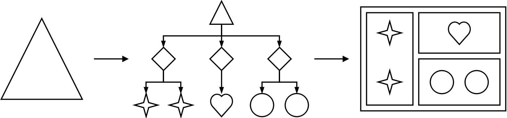
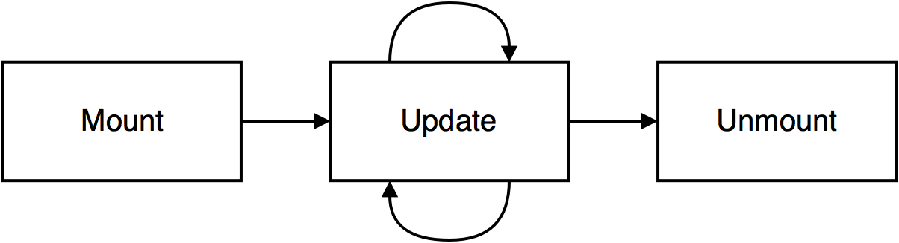
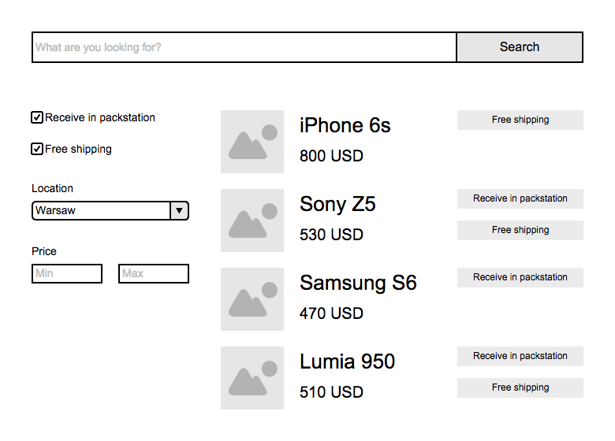
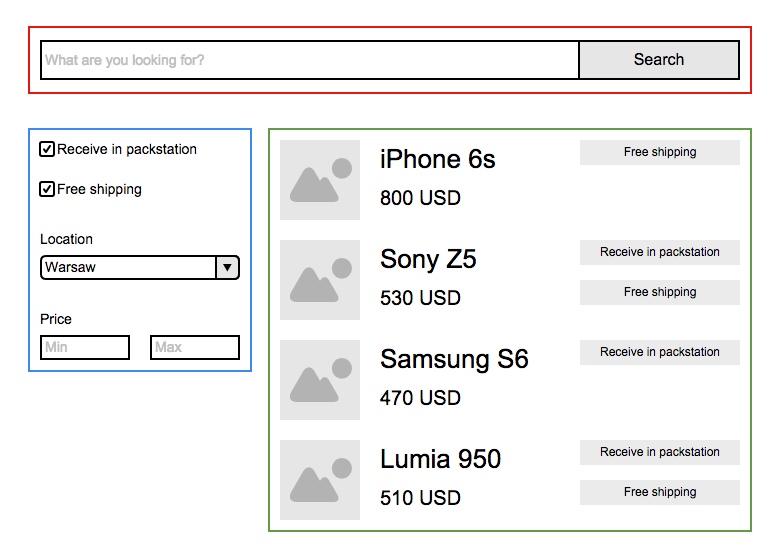
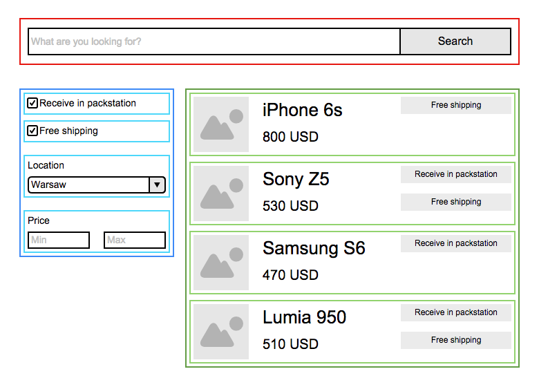
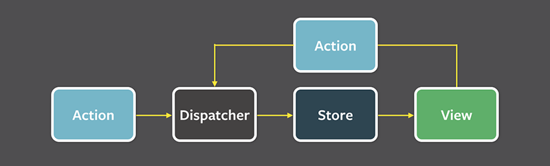

title: React Workshop
author:
  name: Pawel Wieladek
  twitter: pawelwieladek
  url: http://pawelwieladek.com
style: style/style.css
output: index.html
controls: false
progress: true

--

# Szkolenie React

--

### Agenda

1. ES6
2. React
3. Flux

--

# ES6


--

### Przydatne linki

[JS Bin](http://jsbin.com/?js,console) - Playground (Zmień język na ES6 / Babel)

[Learn Babel](http://babeljs.io/docs/learn-es2015/) - Dokumentacja Babel

[MDN](https://developer.mozilla.org/en-US/) - Mozilla Developer Network

[2ality](http://www.2ality.com/) - Blog o nowinkach w ES6

--

### Zmienne

```js
// ES5
var hoisted;
```

```js
// ES6
let blockScoped;
```

```js
// ES6
const blockScoped;
```

#### Var

```js
var a = 1;

if (a === 1) {
  var b = 2;
}

console.log(a);
// 1
console.log(b);
// 2
```

#### Let

```js
let c = 1;

if (c === 1) {
  let d = 2;
}

console.log(c);
// 1
console.log(d);
// ReferenceError: d is not defined

for (let i = 0; i < 10; i++) {
    console.log(i);
}

console.log(i);
// ReferenceError: i is not defined
```

#### Const

```js
const PI = 3.14;
PI = 3.141593;
// throws "PI" is read-only
```

--

### String

```js
'This ia a plain string.'
`This is a plain string as well.`
```

```js
// ES5
'Multiline strings' +
'in ES5 are' +
'not legal.'

// ES6
`Multiline strings
 in ES6 are
 legal from now.`
```

#### Interpolacja

```js
var name = 'world';

// ES5
'Hello ' + name + '!';

// ES6
`Hello ${name}!`; 
```

Więcej: [Template literals @ MDN](https://developer.mozilla.org/en-US/docs/Web/JavaScript/Reference/Template_literals)

--

### Obiekty

#### Pola

```js
let name = 'Pawel';

// ES5
var me = { 
    name: name
};

// ES6
let me = { 
    name
};

console.log(me.name);
// Pawel
```

#### Metody

```js
// ES5
var me = {
    sayHello: function(name) {
        return 'Hi, ' + name;
    }
};

// ES6
let me = {
    sayHello(name) {
        return `Hi, ${name}`;
    }
};

console.log(me.sayHello('everyone'));
// Hello, everyone!
```

#### Getter

```js
let me = {
    firstName: 'Pawel',
    lastName: 'Wieladek',
    get name() {
        return `${this.firstName} ${this.lastName}`;
    }
};

console.log(me.name);
// Pawel Wieladek
```

#### Setter

```js
let me = {
    counter: 0,
    firstName: 'Pawel',
    lastName: 'Wieladek',
    get greeting() {
        return `Hello, I'm ${this.firstName} ${this.lastName}`;
    }
    set name(value) {
        this.firstName = value;
        this.counter++;
    }
};

me.name = 'Pablo';

console.log(me.greeting);
// Hello, I'm Pablo Wieladek!

console.log(me.counter);
// 1
```

#### *Computed property names*

```js
// ES5
function createIconClassNames(name, size) {
    var classNames = {};
    classNames['icon-' + name] = !!name;
    classNames['icon-' + size] = !!size;
    return classNames;
}

// ES6
function createIconClassNames(name, size) {
    return {
        [`icon-${name}`]: !!name,
        [`icon-${size}`]: !!size
    });
}

let iconClassNames = createIconClassNames('square', 'large');

console.log(iconClassNames);
// { 'icon-square': true, 'icon-large': true }
```

--

### *Destructuring*

#### *List matching*
```js
var [a, b, c] = [1, 2, 3, 4];

console.log(a);
// 1;
console.log(b);
// 2;
console.log(c);
// 3;
```

#### *List matching* z pominięciem elementów

```js
let [a, , c] = [1, 2, 3, 4];

console.log(a);
// 1;
console.log(c);
// 3;
```

#### *Object matching*

```js
function createPerson() {
    return { 
        firstName: 'Pawel',
        lastName: 'Wieladek'
    };
}

let { firstName, lastName } = createPerson();

console.log(firstName);
// Pawel
console.log(lastName);
// Wieladek
```

#### *Object matching* ze zmianą nazwy

```js
function createPerson() {
    return { 
        firstName: 'Pawel',
        lastName: 'Wieladek'
    };
}

let { firstName: f, lastName: l } = createPerson();

console.log(f);
// Pawel
console.log(l);
// Wieladek
```

#### *Object matching* jako argument funkcji

```js
function sayHello({ first, last }) {
    // first and last are variables from now
    return `Hello, I'm ${first} ${last}!`;
}

let greeting = sayHello({ 
    first: 'Pawel', 
    last: 'Wieladek'
});

console.log(greeting);
// Hi, I'm Pawel Wieladek!
```

--

### Argumenty domyślne i zmienna liczba argumentów

#### Argument domyślny

```js
function multiply(a, b = 1) {
    return a * b;
}

console.log(multiply(5));
// 5
console.log(multiply(2, 3));
// 6
```

#### Zmienna liczba argumentów

```js
function append(a, ...b) {
    // b is an Array
    return a + ', ' + b.join(', ');
}

console.log(append('apple', 'orange', 'plum', 'kiwi'));
// apple, orange, plum, kiwi
```

#### Operator *spread*

```js
function add(x, y, z) {
  return x + y + z;
}

let args = [1, 2, 3];
console.log(add(...args));
// 6
```

--

### Wyrażenia lambda

#### Jeden argument

```js
[1, 2, 3, 4].map(x => x * 2);    

// [2, 4, 6, 8]
```

#### Wiele argumentów

```js
['a', 'b', 'c', 'd'].map((value, index) => {
    index = index + 1;
    return [index, value];
}); 

// [[1, 'a'], [2, 'b'], [3, 'c'], [4, 'd']]
```

#### Wiele argumentów + *destructuring*

```js
[[1, 'a'], [2, 'b'], [3, 'c'], [4, 'd']].map(([index, value]) => {
    return {
        [value]: index 
    };
});

// [ { a: 1 }, { b: 2 }, { c: 3 }, { d: 4 } ]
```

#### ```this``` *autobinding*

```js
// ES5
function AsyncCounter(initialValue) {
    this.value = initialValue;
}

AsyncCounter.prototype.increment = function() {
    setTimeout(function() {
        this.value++;
    }.bind(this), 100);
};

// ES6
class AsyncCounter {
    constructor(initialValue) {
        this.value = initialValue;
    }
    
    increment() {
        setTimeout(() => {
            // `this` is bound to the value of current context
            this.value++;
        }, 100);
    }
}
```

--

### Klasy

- dziedziczenie oparte na prototypach
- konstruktor
- metody klasy bazowej
- metody statyczne i metody instancji

ES6 **nie udostępnia** poniższych funkcji języka:

- interfejsy
- wielodziedziczenie
- przeciążanie konstruktora

### Klasa bazowa

```js
class Point {
    constructor(x, y) {
        this.x = x;
        this.y = y;
    }
  
    toString() {
        return `x = ${this.x}, y = ${this.y}`;
    }
}

let p = new Point(3, 4);

console.log(p.toString());      
// x = 3, y = 4

// toString overridden
console.log('' + p);            
// x = 3, y = 4

console.log(`${p}`);            
// x = 3, y = 4
```

### Klasa pochodna

```js
class ColorPoint extends Point {
    constructor(x, y, color) {
        super(x, y);
        this.color = color;
    }
  
    static createDefault() {
        return new ColorPoint(0, 0, 'black');
    }
  
    toString() {
        return `${super.toString()}, color = ${this.color}`;
    }
}

let p = new ColorPoint(2, 3, 'red');

console.log(p.toString());      
// x = 2, y = 3, color = red

let q = ColorPoint.createDefault();

console.log(q.toString());      
// x = 0, y = 0, color = black
```

--

### Moduły

#### Eksport domyślny

```js
// square.js

export default function square(x) {
    return x * x;
}
```

```js
// main.js

import sq from './square';

console.log(sq(8));
// 64
```

#### Eksport nazwany

```js
// math.js

export const PI = 3.14;

export function square(x) {
    return x * x;
}
```

```js
// main.js

import { square, PI } from './math';

console.log(PI);
// 3.14
console.log(square(8));
// 64
```

```js
// main.js

import * as common from './math';

console.log(common.PI);
// 3.14
console.log(common.square(8));
// 64
```

#### Dobra praktyka
**Eksport nazwany** wymusza używanie dokładnej nazwy klasy, co pomaga w utrzymaniu spójności kodu.

[ECMAScript 6 modules: the final syntax @ 2ality](http://www.2ality.com/2014/09/es6-modules-final.html)

--

### Promise

```js
function fetch() {
    return new Promise((resolve, reject) => {
        request
            .get('https://api.github.com/zen')
            .end((error, response) => {
                if (error) reject();
                resolve(response);
            });
    });
}

function main() {
    return fetch()
        .then(response => {
           console.log(response);
        })
        .catch(error => {
           console.log(error);
        });
}
```

--

# React


--

### Przydatne linki

[CodePen](http://codepen.io/pawelwieladek/pen/BjGNxX/?editors=0010)

[React Docs](https://facebook.github.io/react/docs/getting-started.html)

--

### Dlaczego React?

#### Tylko UI

Najważniejszym celem jest renderowanie. Pozostałe elementy aplikacji można dowolnie skonfigurować. 

#### Łatwy do zrozumienia przepływ danych

Wynik renderowania jest funkcją stanu i danych wejściowych. 

#### Wysoka wydajność - Virtual DOM

Dodatkowa warstwa abstrakcji nad DOM upraszcza komunikację z przeglądarką.

--

### Komponenty

Każdy komponent, z którego składa się layout aplikacji to niezależny klocek.
Komponenty składają się z innych komponentów tworząc **drzewo komponentów**

#### Single Responsibility Principle

Kiedy problem staje się zbyt złożony komponent powinien być podzielony na mniejsze komponenty.
Mały komponent jest łatwy do **zrozumienia**, **utrzymania** i **testowania**.



--

### Virtual DOM

**Operacje na DOM są kosztowne**.

Zamiast operować na poszczególnych elementach DOM, React tworzy wirtualne drzewo komponentów (**Virtual DOM**), wykrywa zmiany i podmienia drzewo.


Podczas renderowania React porównuje stare i nowe drzewo i **modyfikuje tylko niezbędne elementy w DOM**.
Znajdowanie minimalnej liczby modyfikacji pomiędzy dwoma dowolnymi drzewami ma złożoność *O(n<sup>3</sup>)*

React używa kilku heurystyk optymalizując złożoność do *O(n)*.

--

### Diff algorithm

#### Klasy komponentów

Dwa komponenty o różnych klasach na tych samych miejscach w drzewie są różne.


#### Listy

Komponenty są porównywane za pomocą podanych kluczy.


#### Poziom po poziomie

Porównywane są komponenty tylko z tych samych poziomów.


--

### Punkt wejścia aplikacji

```js
// <div id="main"></div>

import ReactDOM from 'react-dom';

import App from './app';

ReactDOM.render(<App />, document.querySelector('#main'));
```

--

### Przykładowy komponent

```js
// ES5
var React = require('react');

var App = React.createClass({
    render: function() {
        return (
            <div className="app">
                App
            </div>
        );
    }
});
```

```js
// ES6
import { Component } from 'react';

class App extends Component {
    render() {
        return (
            <div className="app">
                App
            </div>
        );
    }
});
```

--

### JSX

#### Input

```xml
<Nav>
    <Header className="primary">Hello world</Header>
    <Link active>Home</Link>
    <Logo />
</Nav>
```

#### Output

```js
React.createElement(Nav, null,
    React.createElement(Header, { className: "primary" }, "Hello world"),
    React.createElement(Link, { active: true }, "Home"),
    React.createElement(Logo, null),
);
```

--

### Props

*Props* to **dane wejściowe** komponentu.

```js
const Hello = React.createClass({
    render() {
        return (
            <h1>Hello, {this.props.name}!</h1>
        );
    }
});

ReactDOM.render(<Hello name="Pawel" />, document.querySelector('#main'));
```

--

### State

Każdy komponent może mieć swój **stan**.
 
Stan powinien być modyfikowany tylko za pomocą metody ```setState```. 

Wywoływanie ```setState``` wyzwala przerenderowanie komponentu i wszystkich jego dzieci.

```js
// ES5
const Counter = React.createClass({
    getInitialState() {
        return {
            count: 5
        };
    },
    render() {
        return (
            <h1>{this.state.count}</h1>
        );
    }
});
```

```js
// ES6
class Counter {
    constructor() {
        this.state = {
            count: 5
        };
    }
    
    render() {
        return (
            <h1>{this.state.count}</h1>
        );
    }
});
```

--

### Przepływ danych

Komponent to **funkcja dwóch zmiennych zmiennych**: *props* i *state* zwracająca wynik renderowania - drzewo węzłów DOM.

Przepływ danych jest **jednokierunkowy** - od góry do dołu drzewa komponentów.

#### Dobre praktyki

Jak najwięcej komponentów powinno być **bezstanowych**.
 
Korzeń drzewa powinien zawierać stan i implementować logikę biznesową, a jego dzieci do wyrenderowania powinny używać wyłącznie propsów.


--

### Events

```js
const Counter = React.createClass({
    getInitialState() {
        return {
            count: 5
        }
    },
    increment() {
        this.setState({
            count: this.state.count + 1
        });
    },
    render() {
        return (
            <button onClick={this.increment}>{this.state.count}</button>
        );
    }
});
```

#### Dobra praktyka

Stan powinien zawierać tylko te dane, które mogą być dynamicznie modyfikowane przez użytkownika.

#### Autobinding**

Metody komponentu utworzonego poprzez ```createClass``` mają **automatycznie dowiązany kontekst ```this```**.

Tworząc komponent za pomocą dziedzieczenia po klasie ```Component``` należy pamiętać o **ręcznym dowiązaniu kontekstu do funkcji**, które nie należą do specyfikacji komponentu.

Najprostszy sposób to zamiast tworzenia metody metody, **utworzenie pola, które jest funkcją lambda**.

```js
handleClick: (event) => {
    event.stopPropagation();
}
```

--

### Złe praktyki
 
#### Przepisywanie wartości ```props```
 
```js
// so bad!
getInitialState() {
    return {
        name: this.props.name  
    };
}
```

#### Nadmiarowe dane
 
```js
// so bad!
handleChange(firstName, lastName) {
    return {
        firstName: firstName,
        lastName: lastName,
        fullName: `${firstName} ${lastName}`
    };
}
```

```js
// instead modify in render
render() {
    let fullName = `${firstName} ${lastName}`;
    return (
        <div>{fullName}</div>
    );
}
```
 
#### Przetrzymywanie komponentów w stanie
 
```js
// so bad!
showForm() {
    this.setState({
        formComponent: <Form />
    });
}
```

```js
// instead handle condition in render
showForm() {
    this.setState({
        formEnabled: true
    });
}

rednerForm() {
    if (this.state.formEnabled) {
        return <Form />;
    }
}

render() {
    let form = this.rednerForm();
    return (
        <div>
            {form}
        </div>
    );
}
```

--

### Cykl życia komponentu



[Component Specs and Lifecycle reference](https://facebook.github.io/react/docs/component-specs.html)
 
--

### ```render```

Jedyna wymagana metoda.
 
Może zwracać ```null``` lub ```false``` jeżeli komponent ma nic nie renderować.
 
Musi zawierać dokładnie jeden węzeł korzenia zwracanego drzewa.
 
--

### ```getInitialState```

```js
object getInitialState()
```

Wywoływana raz, przed zamontowaniem komponentu.
 
Zwraca początkową wartość dostępną w ```this.state``` podczas pierwszego renderowania.
 
--

### ```getDefaultProps```

```js
object getDefaultProps()
```

Metoda statyczna dla klasy, wywoływana podczas konstruowania klasy.
 
Zwraca domyślne wartości dostępne w ```this.props``` jeżeli nie zostaną podane podczas tworzenia instancji komponentu.
 
--

### ```componentWillMount```

```js
void componentWillMount()
```

Wywoływana raz, tuż przed pierwszym renderowaniem komponentu.
 
--

### ```componentDidMount```

```js
void componentDidMount()
```

Wywoływana raz, tuż po pierwszym renderowaniu komponentu.
 
#### Dobra praktyka

Miejsce na integrację z innymi bibliotekami np. jQuery, D3 oraz wysyłanie requestów.
 
--

### ```componentWillReceiveProps```

```js
void componentWillReceiveProps(
  object nextProps
)
```

Wywoływana za każdym razem, tuż przed otrzymaniem nowych danych weściowych.
 
Nie wywoływana podczas pierwszego renderowania.
 
--

### ```shouldComponentUpdate```

```js
boolean shouldComponentUpdate(
  object nextProps, object nextState
)
```

Wywoływana za każdym razem, gdy komponent otrzymuje nowe dane wejściowe lub zmienia swój stan.
 
Nie wywoływana podczas pierwszego renderowania.
 
Jeżeli zwróci ```false``` to nie zostaną wywołane metody ```render```, ```componentWillUpdate``` oraz ```componentDidUpdate```.
 
--

### ```componentWillUpdate```

```js
void componentWillUpdate(
  object nextProps, object nextState
)
```

Wywoływana za każdym razem, gdy komponent otrzymuje nowe dane wejściowe lub zmienia swój stan, tuż przed renderowaniem.
 
Nie wywoływana podczas pierwszego renderowania.
 
--

### ```componentDidUpdate```

```js
void componentDidUpdate(
  object prevProps, object prevState
)
```

Wywoływana tuż po zaaplikowaniu zmian w DOM.
 
Nie wywoływana podczas pierwszego renderowania.
 
--

### ```componentWillUnmount```

```js
void componentWillUnmount()
```

Wywoływana tuż przed odmontowaniem komponentu.

#### Dobra praktyka

Miejsce na cleanup.
 
--

### Dynamiczne komponenty

Każdy dynamicznie tworzony komponent powinien zawierać unikalny klucz ```key```.

```js
render() {
    let results = this.props.results.map(result => {
        return <li key={result.id}>{result.text}</li>;
    });
    return (
        <ul>
            {results}
        </ul>
    );
}
```

--

### *Mixins*
  
```js
const AuthMixin = {
    componentDidMount() {
        if (!authorized()) {
            // redirect to login page...
        }
    },
    authorized() {
        // do some OAuth...
    }
};

const Page = React.createClass({
    mixins: [ AuthMixin ],
    render() {
        return (
            <div>You are {authorized() ? 'authorized' : 'not authorized'}</div>
        );
    }
});
```

--

### *PropTypes*

Walidacja danych wejściowych komponentu.

```js
React.createClass({
    propTypes: {
        name: React.PropTypes.string,
        onClick: React.PropTypes.func.isRequired
    },
    getDefaultProps() {
        return {
            onClick: () => {}
        };
    },
    render() {
        return (
            <div>
                <h1>Hello, {this.props.name}!</h1>
                <button onClick={this.props.onClick}>Click me</button>
            </div>
        );
    }
});
```

#### Dobra praktyka

Każdy element ```this.props``` powinien zostać zwalidowany w ```propsTypes```.

Walidacja danych wejściowych powinna być **wyłączona** na produkcji, ponieważ istotnie spowalnia renderowanie strony.

[Prop Types reference @ React Docs](https://facebook.github.io/react/docs/reusable-components.html)

[Performance Engineering with React](http://benchling.engineering/performance-engineering-with-react/)
 
--

### Referencje

Za pomocą atrybutu ```ref``` można przechować referencję do instancji komponentu potomnego.

```js
getValue() {
    return ReactDOM.findDOMNode(this.refs.input).value;
},
render() {
    return (
        <input type="text" ref="input" />
    );
}
```

--

### *Uncontrolled Component*

- Komponent stanowy

- Nie ma możliwości zmiany prezentowanej wartości z zewnątrz

### *Controlled Component*

- Komponent bezstanowy

- Wartość musi zostać obsłużona w stanie jednego z komponentów nadrzędnych

- Pełna kontrola nad prezentowaną wartością

--

### *Uncontrolled Component*

<p data-height="500" data-theme-id="0" data-slug-hash="YwRXJd" data-default-tab="js" data-user="pawelwieladek" class='codepen'>See the Pen <a href='http://codepen.io/pawelwieladek/pen/YwRXJd/'>React Uncontrolled Component</a> by Pawel Wieladek (<a href='http://codepen.io/pawelwieladek'>@pawelwieladek</a>) on <a href='http://codepen.io'>CodePen</a>.</p>
<script async src="//assets.codepen.io/assets/embed/ei.js"></script>

--

### *Controlled Component*

<p data-height="500" data-theme-id="0" data-slug-hash="bEQVww" data-default-tab="js" data-user="pawelwieladek" class='codepen'>See the Pen <a href='http://codepen.io/pawelwieladek/pen/bEQVww/'>React Controlled Component</a> by Pawel Wieladek (<a href='http://codepen.io/pawelwieladek'>@pawelwieladek</a>) on <a href='http://codepen.io'>CodePen</a>.</p>
<script async src="//assets.codepen.io/assets/embed/ei.js"></script>

--

# Case study

--



--



--



--

# Flux

--




